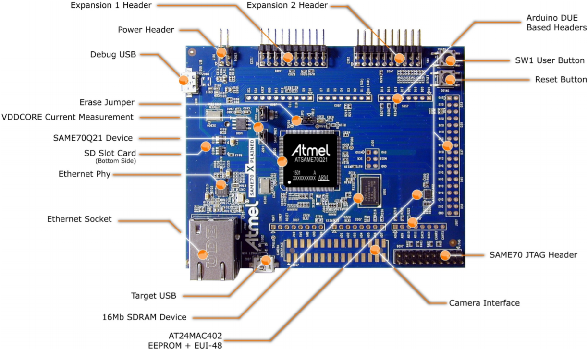
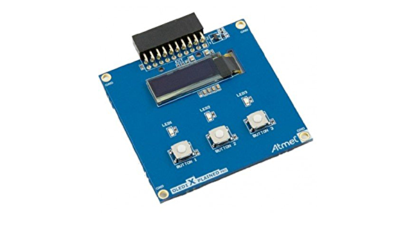
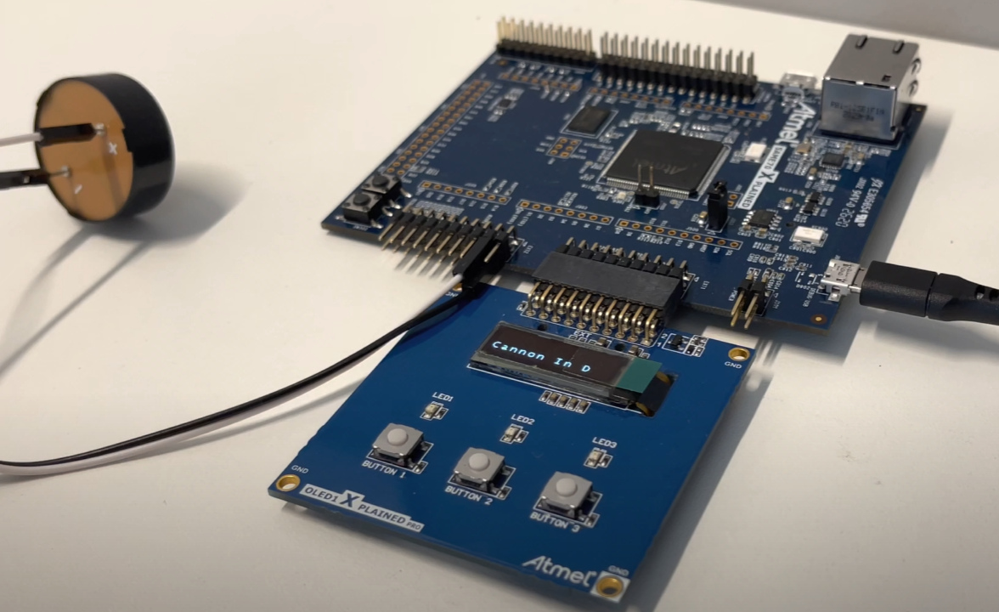

# APS 1 de Computação Embarcada - Musical!

  <h1>Autor:</h1>
  <kbd>
  
  </kbd>
    
    
  
  [Nicolas Queiroga](https://github.com/NicolasQueiroga)
  

- O objetivo final desta APS é implementar um **player** de músicas simples no micro-controlador **Atmel SAME70Q21**, acoplado à interface **SAME70 Xplained Pro**, utilizando a placa de expansão **OLED1XPLAINED Pro** para adicionar ao player **três botões**, **três LED's** e **um display OLED**, e um **buzzer**, utilizado para reproduzir as músicas.

  
  
  

# Documentação
 - A tabela a seguir indica quais perifericos disponíveis foram utilizados com seus respectivos pinos
 
| Função  | PINO |
|---------|-----------------|
| BUZZER  |       PD30       |
| LED_PLACA (acende junto com as notas reproduzidas) | PC8|
| LED1 (indicador de seleção de faixa anterior)|PA0|
|LED2 (indicador de pause)|PC30|
|LED3 (indicador de seleção de faixa seguinte)|PB2|
| BACKWARD (volta à faixa anterior, se existir) |     PD28      |
| START_STOP |    PC31      |
| FORWARD (avança uma faixa, se existir) |    PA19       |

## Estruturação do Software
### Todos os arquivos citados abaixo poderão ser acessados no seguinte diretorio: `22a-emb-aps1-sheesh/firmware/src/`
- `aps1.h`
  * Aqui foram definidas todas as **constantes** utilizadas ao longo do codigo, assim como os **structs** e **protótipos de funções** utilizadas nos arquivos `aps1.c` e `main.c`.
  * A biblioteca necessária para que seja possível a interação com o **micro-controlador** (`#include "asf.h"`) foi incluída apenas neste arquívo.
  
- `aps1.c`
  * Neste arquívo foram feitas as **implementações das funções prototipadas** em `aps1.h`, consequentemente fazendo uso da biblioteca `asf.h`, ou seja, é o arquívo onde praticamente toda a logica necessária para implementar o **player** foi criada.
  
- `notes.h`
  * Este foi o arquívo onde foram definidas **todas as notas necessárias** para que sejam reutilizadas nos arquivos `.h` das músicas sem que precisemos repetir suas definições para cada uma delas.
  
- `tetris.h`, `starwars.h` e `cannonind.h`
  * Os três arquivos foram utilizados para guardar informações essênsiais de cada uma das três músicas escolhidas (créditos ao autor do codigo de cada música no final deste README.me), como o tempo, título e vetor de todas as notas e pausas necessárias para que as músicas sejam reproduzidas com sucesso.
  * Para que esses três arquívos tenham acesso ao arquívo onde as definições das notas estão, basta incluir o arquívo `notes.h` em todos.
  
- `main.c`
  * Este arquívo necessita ter somente o necessário para que o software seja compilado e executado com sucesso, ou seja, nele foram, primeiramente, incluidos os arquívos `aps1.h`, para que seja possível acessar os **defines** e as **funções implementadas** em `aps1.c` se necessárias, assim como ter acesso aos structs construídos, para que guardem as músicas utilizadas de uma maneira mais adequada. E como já estamos incluindo o arquívo `asf.h` dentro de `aps1.h`, não será necessário incluí-lo uma segunda vez em `main.c`.
  * Além daquilo que é dísponível à este arquívo por meio de `#include "aps1.h"`, outro item indispensável é o **while central** do software, onde é realizada a chamada de funções que realizam a **seleção** e **reprodução** da faixa escolhida se apertados certos botões.

## Lógica do Software
- A lógica implementada para que o programa rode conforme o esperado é baseada nas seguintes ideias:
  * Para o preprocessamento, **são inicializadas três structs** do tipo `Song` com as informações de **título**, **tempo**, **melodia** e **tamanho de melodia** de cada música a ser tocada
  * Com as três structs criadas, são adicionadas a um vetor de structs do tipo `Song` dentro de uma nova struct chamada `Disc`, juntamente com o indice (de 0 a 2) das possíveis músicas a serem tocadas. O endereço desse struct `Disc` será enviado às funções de processamento para ser possível a alteração imediata do indice de reprodução quando necessário por diferentes funções.
  * Ao iniciar o programa, o usuário será apresentado com um título de uma música, onde, se quiser, pode selecionar uma música anterior ou posterior (incrementando ou reduzindo o indice de reprodução do struct `Disc`).
  * Com o título da música desejada apresentado na tela OLED, apertando o botão central (play/pause), uma serie de processamentos serão feitos para que a faixa seja reproduzida.
    * É feito um **for loop** para cada nota e sua respectiva duração que sera encerrado quando a música se encerrar ou se o usuário quiser mudar de faixa.
    * Com a informação da nota a ser tocada e o tempo de duração dela coletada do struct `Disc`, é chamada uma função, que está na camada mais baixa do código,  que serve para reproduzi-la (a função `tone`).
    * Para que as ações de pausar/continuar, pular ou voltar uma faixa, sejam responsivas o suficiente, suas lógicas são implementadas dentro da função `tone`.

### Para maiores informações acesse este <a href="https://insper.github.io/ComputacaoEmbarcada/APS-1-Musical/">link</a>:

### Acesse o <a href="https://youtu.be/NtmTIDbfkYo">Vídeo do projeto</a>

### Músicas e Direitos autorais:
- Autor dos arquívos abaixo: <a href="https://github.com/robsoncouto">Robson Couto</a>, 2019
-  <a href="https://github.com/robsoncouto/arduino-songs/blob/master/starwars/starwars.ino">Dart Vader theme (Imperial March) - Star wars</a> | Score available at https://musescore.com/user/202909/scores/1141521
-  <a href="https://github.com/robsoncouto/arduino-songs/blob/master/tetris/tetris.ino">Tetris theme - (Korobeiniki)</a> | Based on the arrangement at https://www.flutetunes.com/tunes.php?id=192
-  <a href="https://github.com/robsoncouto/arduino-songs/blob/master/cannonind/cannonind.ino">Cannon in D - Pachelbel</a> | Score available at https://musescore.com/user/4710311/scores/1975521
   
